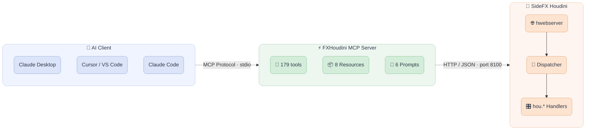

<div align="center">

  
  &nbsp;&nbsp;&nbsp;&nbsp;
  

  <h3 align="center">fxhoudinimcp</h3>

  <p align="center">
    The most comprehensive MCP server for SideFX Houdini.
    <br/>
    179 tools across 22 categories, covering every major Houdini context.
    <br/><br/>
  </p>

  ##

  <p align="center">
    <!-- Maintenance status -->
    &nbsp;&nbsp;
    <!-- License -->
    &nbsp;&nbsp;
    <!-- Last Commit -->
    &nbsp;&nbsp;
    <!-- Commit Activity -->
    <a href="https://github.com/healkeiser/fxhoudinimcp/pulse" alt="Activity">
      </a>&nbsp;&nbsp;
    <!-- PyPI version -->
    <a href="https://pypi.org/project/fxhoudinimcp/">
      </a>&nbsp;&nbsp;
    <!-- PyPI downloads -->
    <a href="https://pepy.tech/projects/fxhoudinimcp"></a> &nbsp;&nbsp;
    <!-- GitHub stars -->
    &nbsp;&nbsp;
  </p>

</div>

<!-- TABLE OF CONTENTS -->
## Table of Contents

- [About](#about)
- [Features](#features)
- [Architecture](#architecture)
- [Installation](#installation)
- [Usage](#usage)
- [Environment Variables](#environment-variables)
- [Development](#development)
- [Contact](#contact)

<!-- ABOUT -->
## About

A comprehensive [MCP](https://modelcontextprotocol.io/) (Model Context Protocol) server for [SideFX Houdini](https://www.sidefx.com/). Connects AI assistants like Claude directly to Houdini's Python API, enabling natural language control over scene building, simulation setup, rendering, and more.

**179 tools**, **8 resources**, and **6 workflow prompts** out of the box.

<!-- FEATURES -->
## Features

| Category | Tools | Description |
|----------|-------|-------------|
| **Graph Intelligence** | 4 | Atomic validated network building, network verification, node doc cards, cook profiling |
| **Documentation** | 2 | Full-text search + page retrieval over Houdini's own shipped manual (version-exact) |
| **Scene Management** | 7 | Open, save, import/export, scene info |
| **Node Operations** | 17 | Create, delete, copy, connect, layout, flags |
| **Parameters** | 11 | Get/set values, expressions, keyframes, spare parameters |
| **Geometry (SOPs)** | 12 | Points, prims, attributes, groups, sampling, nearest-point search |
| **LOPs/USD** | 18 | Stage inspection, prims, layers, composition, variants, lighting |
| **DOPs** | 8 | Simulation info, DOP objects, step/reset, memory usage |
| **PDG/TOPs** | 10 | Cook, work items, schedulers, dependency graphs |
| **COPs (Copernicus)** | 7 | Image nodes, layers, VDB data |
| **HDAs** | 10 | Create, install, manage Digital Assets and their sections |
| **Animation** | 9 | Keyframes, playbar control, frame range |
| **Rendering** | 9 | Viewport capture, render nodes, settings, render launch |
| **VEX** | 5 | Create/edit wrangles, validate VEX code |
| **Code Execution** | 4 | Python, HScript, expressions, env variables |
| **Viewport/UI** | 13 | Pane management, screenshots, status messages, error detection |
| **Scene Context** | 8 | Network overview, cook chain, selection, scene summary, error analysis |
| **Workflows** | 8 | One-call Pyro/RBD/FLIP/Vellum setup, SOP chains, render config |
| **Materials** | 5 | List, inspect, create materials and shader networks |
| **CHOPs** | 4 | Channel data, CHOP nodes, export channels to parameters |
| **Cache** | 4 | List, inspect, clear, write file caches |
| **Takes** | 4 | List, create, switch takes with parameter overrides |

<!-- ARCHITECTURE -->
## Architecture



Uses Houdini's built-in `hwebserver`. No custom socket servers, no rpyc. Uses `hdefereval.executeInMainThreadWithResult()` to safely run `hou.*` calls on the main thread.

<!-- INSTALLATION -->
<!-- --8<-- [start:installation] -->
## Installation

### Requirements

- **Houdini** 20.5+ (integration suite green on 20.5.278, 20.5.487, 20.5.613, 20.5.654, 21.0.440 and 22.0.368)
- **Python** 3.10+
- **MCP SDK** (`mcp` package) 1.8+

### Quick start

Two commands, if nothing on your machine is ambiguous:

```shell
pip install fxhoudinimcp
fxhoudinimcp install
```

`install` does both halves: it writes the Houdini package file pointing at this
exact install, and registers the server with Claude Code and Claude Desktop
using the absolute path of the Python you installed into. Add `--dry-run` to see
what it would touch without changing anything.

It stops and asks when it cannot know the answer. If several Houdini packages
directories exist, it lists them rather than guessing, because guessing wrongly
produces an install that fails silently:

```shell
fxhoudinimcp install --houdini-dir "~/Documents/houdini22.0/packages"
```

Other flags: `--client claude-code|claude-desktop|both|none` to control which
client is touched, and `--client-only` to register a client without touching the
Houdini side (useful on a second machine, or after moving to a different Python).

Prefer `python -m fxhoudinimcp install` over the bare `fxhoudinimcp install` if
you have more than one Python. Both work, but the module form is
self-correcting: whichever interpreter you run it with is the one written into
the client config, so if the command runs at all, the path it registers is right.

The step-by-step version follows, for when something needs untangling.

### 1. Install the MCP Server

**From PyPI:**

```shell
pip install fxhoudinimcp
```

**From source:**

```shell
pip install -e .
```

Or with development dependencies:

```shell
pip install -e ".[dev]"
```

### 2. Install the Houdini Plugin

Since **2.1.0** the plugin ships inside the Python package, so `pip install
--upgrade fxhoudinimcp` updates both halves together. Before that they were
distributed separately and it was easy to upgrade one and leave the other
behind; the server now warns at startup when it finds a plugin older than
itself.

`fxhoudinimcp install` (above) does this step for you. The rest of this section
is the manual route.

**Option A: let the CLI write the package file (recommended)**

```shell
fxhoudinimcp houdini-package
```

That prints the Houdini package file with the plugin path already filled in for
*this* install, plus the Houdini packages directories it found on your machine.
Write it with:

```shell
fxhoudinimcp houdini-package --write "~/Documents/houdini22.0/packages"
```

Then restart Houdini and check the **MCP** menu.

Do not type the plugin path by hand. It lives inside the Python environment you
installed into, so it changes if you recreate a virtualenv, switch to uv or
pipx, or move between Python versions, and Houdini says nothing when a package
path stops resolving. `--path-only` prints just the path if you need it for
scripting.

The command deliberately does not pick a packages directory for you. On Windows
with OneDrive's Documents redirection, a desktop-launched Houdini and a
shell-launched one can resolve different preference directories, so it lists
candidates and lets you choose. It also warns if another `fxhoudinimcp.json`
already exists elsewhere, because Houdini processes every packages directory and
lets the last one win, which is how a stale clone silently overrides a fresh
install.

**Option A2: point at a clone instead**

Contributors, or anyone who wants the plugin tracked by git, can skip the CLI and
write the package file by hand against a checkout:

```json
{ "env": [ { "FXHOUDINIMCP": "C:/Users/you/code/fxhoudinimcp/houdini" } ],
  "path": "$FXHOUDINIMCP" }
```

Forward slashes work on every platform. The path must end in `/houdini` and must
contain `scripts/`, `MainMenuCommon.xml` and the `python3.Xlibs/` folders. Do not
do this *and* Option A, or the two package files will fight.

The package file is also where you configure the plugin. It ships every
Houdini-side setting at its default, so they are all visible in one place:
`FXHOUDINIMCP_PORT`, `FXHOUDINIMCP_BIND`, `FXHOUDINIMCP_AUTOSTART` and
`FXHOUDINIMCP_AUTO_LAYOUT` (see [Environment Variables](#environment-variables)
for what each does). Two things to know:

- Because the package sets these explicitly, it **wins over the same variable
  set in your shell**. Change them here, not in your environment. Houdini's
  package format has no "only if unset" method, and it rejects JSON comments,
  so there is no way to ship them inert.
- `HOUDINI_HOST`, `HOUDINI_PORT`, `MCP_TRANSPORT` and `LOG_LEVEL` do **not**
  belong here. They are read by the MCP server process that your client
  launches, not by Houdini, so setting them in this file has no effect --
  configure those in your MCP client instead. If you change
  `FXHOUDINIMCP_PORT`, set `HOUDINI_PORT` to match on the client side.

Two ways this step fails silently, both worth knowing:

- **A path that does not exist.** Houdini skips a package whose path cannot be
  resolved without printing anything. Nothing loads: no **MCP** menu, no
  auto-start, no `fxhoudinimcp_server` module.
- **A UTF-8 BOM.** Houdini's JSON parser rejects a leading BOM and skips the
  whole package. On Windows, `Set-Content -Encoding UTF8` adds one; use
  `Set-Content -Encoding utf8NoBOM` (PowerShell 7+) or an editor that can save
  without a BOM. The file looks correct either way, which is what makes this
  one nasty.

To see what Houdini actually did with your package, start it with the package
log enabled and look for your file:

```shell
# Windows (PowerShell)
$env:HOUDINI_PACKAGE_VERBOSE=1; houdini
# Linux / macOS
HOUDINI_PACKAGE_VERBOSE=1 houdini
```

A working package prints both a `Loading:` and a `Processing:` line for
`fxhoudinimcp.json`.

**Option B: Manual copy**

Copy the contents of `houdini/` into your Houdini user preferences directory so that:
- `scripts/python/fxhoudinimcp_server/` is on Houdini's Python path
- `python3.Xlibs/uiready.py` auto-starts the server (copy the folder matching your Houdini's Python version: 3.11 for Houdini 20.5 and 21.0, 3.13 for Houdini 22.0)
- `MainMenuCommon.xml` adds the **MCP** menu to Houdini's menu bar

### 3. Configure Your MCP Client

**Claude Desktop** (`claude_desktop_config.json`):

```json
{
  "mcpServers": {
    "fxhoudini": {
      "command": "python",
      "args": ["-m", "fxhoudinimcp"],
      "env": {
        "HOUDINI_HOST": "localhost",
        "HOUDINI_PORT": "8100"
      }
    }
  }
}
```

**Claude Code** (global — available in every project):

```shell
claude mcp add --scope user fxhoudini -- python -m fxhoudinimcp
```

Or to scope it to a single project, add a `.mcp.json` in the project root:

```json
{
  "mcpServers": {
    "fxhoudini": {
      "command": "python",
      "args": ["-m", "fxhoudinimcp"]
    }
  }
}
```

> [!TIP]
> If Claude Desktop reports the server as **disconnected**, replace `"python"` with the
> **full absolute path** to your Python executable. Claude Desktop does not always inherit
> your system PATH. Find it with:
>
> ```shell
> python -c "import sys; print(sys.executable)"
> ```
>
> Then use the result in your config, e.g. `"command": "C:\\Program Files\\Python311\\python.exe"`.
> After any config change, fully quit Claude Desktop (system tray → Quit) and relaunch.
<!-- --8<-- [end:installation] -->

<!-- USAGE -->
## Usage

Launch Houdini normally. The plugin auto-starts once when the UI is ready (controlled by `FXHOUDINIMCP_AUTOSTART` env var). The startup script uses `uiready.py`, which stacks correctly with other Houdini packages. You can also control it manually from the **MCP** menu (Start Server, Stop Server, Connect a Client, Server Status).

**MCP > Connect a Client...** prints the `claude mcp add` line for the port this
session actually ended up on, and copies it to the clipboard. That matters with
more than one Houdini open: a second session moves itself to the next free port,
so the configured port and the real one differ.

Startup verifies that Houdini's `mcp.health` endpoint answers from the current
Houdini process before printing that the server is ready. If your assistant
cannot reach Houdini after an app restart, call `get_houdini_connection_status`
for structured diagnostics, then relaunch Houdini or align `FXHOUDINIMCP_PORT`
and `HOUDINI_PORT` if another process owns the port.

Once connected, your AI assistant can:

```
"Create a procedural rock generator with mountain displacement"
"Set up a Pyro simulation with a sphere source"
"Build a USD scene with a camera, dome light, and ground plane"
"Create an HDA from the selected subnet"
"Debug why my scene has cooking errors"
```

<!-- ENVIRONMENT VARIABLES -->
## Environment Variables

| Variable | Default | Description |
|----------|---------|-------------|
| `HOUDINI_HOST` | `localhost` | Houdini host address |
| `HOUDINI_PORT` | `8100` | Houdini hwebserver port |
| `FXHOUDINIMCP_PORT` | `8100` | Port for the Houdini plugin to listen on |
| `FXHOUDINIMCP_AUTOSTART` | `1` | Set to `0` to disable auto-start |
| `FXHOUDINIMCP_AUTO_LAYOUT` | `1` | Set to `0` to disable automatic node layout (preserves manual layouts) |
| `FXHOUDINIMCP_BIND` | `127.0.0.1` | Address the Houdini plugin binds. Loopback by default: the bridge runs arbitrary Python in your Houdini session and has no authentication, so only widen this on a network you trust |
| `MCP_TRANSPORT` | `stdio` | MCP transport (`stdio` or `streamable-http`) |
| `LOG_LEVEL` | `INFO` | Logging level |

<!-- DEVELOPMENT -->
## Development

```shell
# Install dev dependencies
pip install -e ".[dev]"

# Run linter
ruff check python/

# Run tests
pytest

# Run integration tests inside a real Houdini (requires a license seat;
# uses the newest installed Houdini, override with the HYTHON env var).
# Works on Windows, macOS, and Linux:
python tests/run_integration.py
# Convenience wrappers: tests/run_integration.ps1 / tests/run_integration.sh

# Contribute this machine's Houdini builds to the node-availability table and
# regenerate the version annotations in server_instructions.md:
python tools/gen_node_versions.py
# Regenerate the derived search hints and the plugin-command manifest
# (run gen_node_domains after gen_node_versions, it reads that table):
python tools/gen_node_domains.py
python tools/gen_required_commands.py
python tools/gen_node_versions.py --check   # verify the table against this machine
HYTHON=/path/to/hython python tools/gen_node_versions.py   # one specific build
```

`tools/node_versions.json` accumulates. It records which builds have been
sampled and what node types each had, so **one installed Houdini is enough**:
your build merges into the shared evidence and the annotations are derived from
everything sampled so far. A contributor with a single Houdini produces exactly
the same table as someone with six. If a version has never been sampled by
anyone, the generator says so rather than guessing, and `--check` reports only
contradictions with the builds you actually have.

That evidence file is ~1 MB and is **not** shipped. The generator also writes
`python/fxhoudinimcp/data/sampled_versions.json`, a few hundred bytes listing
only which versions have been sampled, which does ship: the server compares the
connected Houdini against it at startup and warns when a version has never been
checked, so a marker like `(21.0+)` silently covering a future 23.0 becomes
visible instead. `get_houdini_connection_status` reports the same thing. It is
advisory: `build_network(dry_run=True)` validates node types against the running
Houdini and cannot go stale.

If Red Giant / Maxon Universe is installed, its OpenFX plug-in crashes `hou`
initialisation on Houdini 20.5.487 and later, so `hython` cannot start at all.
Set `HOUDINI_DISABLE_OPENFX_DEFAULT_PATH=1` when running any of the above.
This is a Houdini/Universe conflict, not something this repo causes.

Unit tests mock `hou` and run anywhere. The integration suite in
`tests/integration/` executes all 179 commands against live Houdini via
`hython` — including end-to-end user scenarios (procedural modeling,
simulation, animation, lookdev) — and prints per-command timing and
coverage reports; it is skipped automatically when `hou` is not
available. `tests/integration/perf_sweep.py` benchmarks handlers on
large scenes, and `python tests/integration/bridge_e2e.py` validates the
full HTTP transport (real hwebserver in hython driven by the MCP
server's own bridge).

### How It Works

1. **Houdini Plugin** (`houdini/`): Runs inside Houdini's Python environment. Registers `@hwebserver.apiFunction` endpoints that receive JSON commands. Uses `hdefereval.executeInMainThreadWithResult()` to safely execute `hou.*` calls on the main thread.

2. **MCP Server** (`python/fxhoudinimcp/`): A standalone Python process using FastMCP. Exposes 179 tools, 8 resources, and 6 prompts via the MCP protocol. Forwards tool calls to Houdini over HTTP.

3. **Bridge** (`python/fxhoudinimcp/bridge.py`): Async HTTP client that sends commands to Houdini's hwebserver and deserializes responses. Handles connection errors and timeouts.

<!-- CONTACT -->
## Contact

Project Link: [fxhoudinimcp](https://github.com/healkeiser/fxhoudinimcp)

<p align='center'>
  <!-- GitHub profile -->
  <a href="https://github.com/healkeiser">
    </a>&nbsp;&nbsp;
  <!-- LinkedIn -->
  <a href="https://www.linkedin.com/in/valentin-beaumont">
    </a>&nbsp;&nbsp;
  <!-- Behance -->
  <a href="https://www.behance.net/el1ven">
    </a>&nbsp;&nbsp;
  <!-- X -->
  <a href="https://twitter.com/valentinbeaumon">
    </a>&nbsp;&nbsp;
  <!-- Instagram -->
  <a href="https://www.instagram.com/val.beaumontart">
    </a>&nbsp;&nbsp;
  <!-- Gumroad -->
  <a href="https://healkeiser.gumroad.com/subscribe">
    </a>&nbsp;&nbsp;
  <!-- Gmail -->
  <a href="mailto:valentin.onze@gmail.com">
    </a>&nbsp;&nbsp;
  <!-- Buy me a coffee -->
  <a href="https://www.buymeacoffee.com/healkeiser">
    </a>&nbsp;&nbsp;
</p>

## License

MIT
